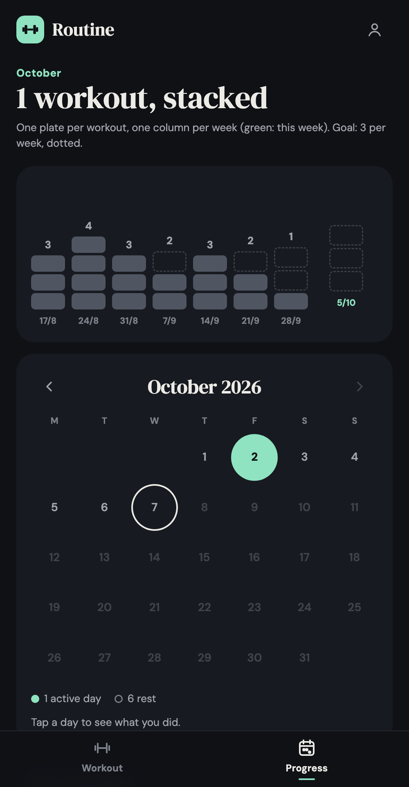

# Routine

**Live app: [marl75.github.io/fitness-coach](https://marl75.github.io/fitness-coach/)** · available in English and French

**Try it without an account: [demo mode](https://marl75.github.io/fitness-coach/?demo&lang=en)** (any email and password work; fake data, kept in your browser)

(Formerly FitCoach; the address is unchanged.)

A small progressive web app to log workouts and keep track of your consistency.

## Features

- **Workout**: add exercises as you go; the app suggests what you did last time
- **One set at a time**, with a visual weight stack to pick the load and quick buttons for reps
- **Exercise picker** with categories, favourites and duplicate detection; unused exercises can be hidden
- **Log another day** from a calendar showing the days you trained
- **Progress**: calendar of days with and without exercise, workouts per week against a goal, progress per exercise
- **Dark mode**

## Stack

- Plain HTML, CSS and JavaScript, no build step
- [Firebase](https://firebase.google.com/) Authentication (email and password) and Firestore; configuration in `js/config.js`, security rules in `firestore.rules`
- Language follows the browser; `?lang=en` or `?lang=fr` in the address forces it
- Without a configuration, or with `?demo` in the address, the app runs in demo mode with fake data kept in the browser
